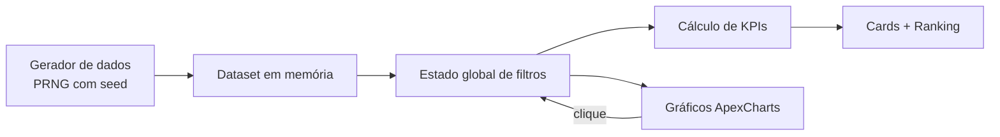

# 📊 Monitoria de Atendimento · Quality Assurance Dashboard

> Dashboard interativo de **auditoria de qualidade em atendimento ao cliente**, recriado em **HTML/CSS/JavaScript + ApexCharts** a partir de um painel Power BI de produção.
> Todos os nomes, marcas e valores são **fictícios** e gerados por seed determinística.

🔗 **Demo ao vivo:** https://diegorodriguesmichelsen-lab.github.io/monitoria/


<!-- Grave um GIF de 10–15s navegando e clicando nos filtros (ScreenToGif / LICEcap) -->

---

## 🎯 O problema

Em operações de suporte, a monitoria de qualidade costuma ser **manual e amostral**: um auditor avalia cerca de 10% dos atendimentos em planilhas, e o feedback chega aos analistas dias depois. A liderança fica sem responder perguntas como:

- Quais analistas, turnos ou marcas concentram as **infrações mais graves**?
- O CSAT ruim é falha do analista ou **problema externo** (produto, sistema, política)?
- A cobertura de auditoria é **estatisticamente relevante**?

## 💡 A solução

Um painel único que conecta **volume, qualidade, satisfação e governança**. Toda visualização é um filtro, para investigar a causa-raiz em poucos cliques.

| Recurso | Descrição |
|---|---|
| **Cross-filtering total** | Clicar em qualquer gráfico (analista, pilar, turno, mês, marca) filtra o painel inteiro, como no Power BI |
| **Score de qualidade ponderado** | Infrações pesam conforme a gravidade, não só pela contagem |
| **CSAT Justificado vs. Volume** | Scatter por analista que separa baixa satisfação causada pelo analista de baixa satisfação causada por fatores externos |
| **Governança de contestações** | Acompanha revisões solicitadas e procedentes, o que dá transparência à auditoria |
| **Cobertura de auditoria** | Auditorias ÷ conversas, para medir a confiabilidade da amostra |
| **Estados vazios tratados** | Combinações de filtros sem dados mostram orientação, nunca um gráfico quebrado |

## 📐 Regras de negócio (KPIs)

```text
Score de Qualidade = 100 − (Σ infrações × peso ÷ auditorias) × 23
Pesos por gravidade: Baixa 0,5 · Média 1 · Grave 3 · Gravíssima 6

CSAT %      = avaliações positivas ÷ avaliações
Conversão   = conversões ÷ conversas
Cobertura   = auditorias ÷ conversas
Procedência = contestações aceitas ÷ contestações
```

> **Por que ponderar?** Uma infração gravíssima (ex.: expor dado sensível) não pode ter o mesmo impacto que um erro de digitação. O peso reflete o risco real para o negócio.

## 🏗️ Arquitetura



| Decisão técnica | Motivo |
|---|---|
| **Dados por seed determinística (Mulberry32)** | A demo é reprodutível: os mesmos números a cada carregamento, sem expor dados reais |
| **Estado de filtros centralizado** | Um único ponto de verdade; todos os visuais re-renderizam a partir dele |
| **Zero build / zero dependências locais** | Um arquivo HTML, ApexCharts via CDN e deploy direto no GitHub Pages |
| **Recriação de Power BI em código** | Interatividade sem licença Pro e com link público aberto |

## 🧰 Stack

`HTML5` · `CSS3` · `JavaScript (ES6+)` · `ApexCharts` · `GitHub Pages`
Modelo de origem: `Power BI` · `DAX` · `BigQuery/SQL`

## 🌍 Contexto real

Este dashboard é a camada visual de um projeto que conduzi em produção, num pipeline com **n8n + REST API (Intercom) + LLMs**:

- Cobertura de auditoria de **~10% (manual)** para **90–100% (automatizada)**
- **+8 mil atendimentos** auditados
- Esforço manual reduzido de **40h para 8h/semana (-80%)**
- **+15% no CSAT** com base nos gaps de escuta ativa, empatia e encerramento identificados
- **~70%** das avaliações negativas atribuídas a **fatores externos** ao analista

> Os dados da demo são fictícios. Os números acima referem-se ao projeto real.

## ▶️ Como rodar

```bash
git clone https://github.com/diegorodriguesmichelsen-lab/monitoria.git
cd monitoria
# abra o index.html no navegador. Não há build.
```

## 🗺️ Próximos passos

- [ ] Exportar a visão filtrada em CSV
- [ ] Separar o gerador de dados em `data.js`
- [ ] Modo escuro

---

**Diego Michelsen** · Automação de Processos & IA
[LinkedIn](https://www.linkedin.com/in/diegomichelsen) · [Hub CORTEX](https://diegorodriguesmichelsen-lab.github.io/hub-enterprise/)
